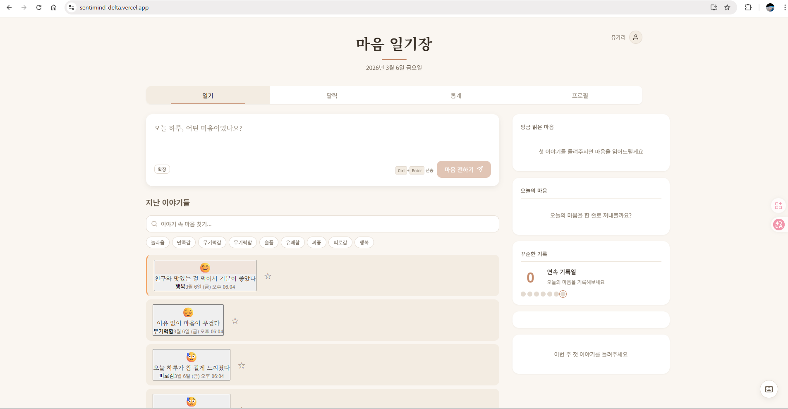
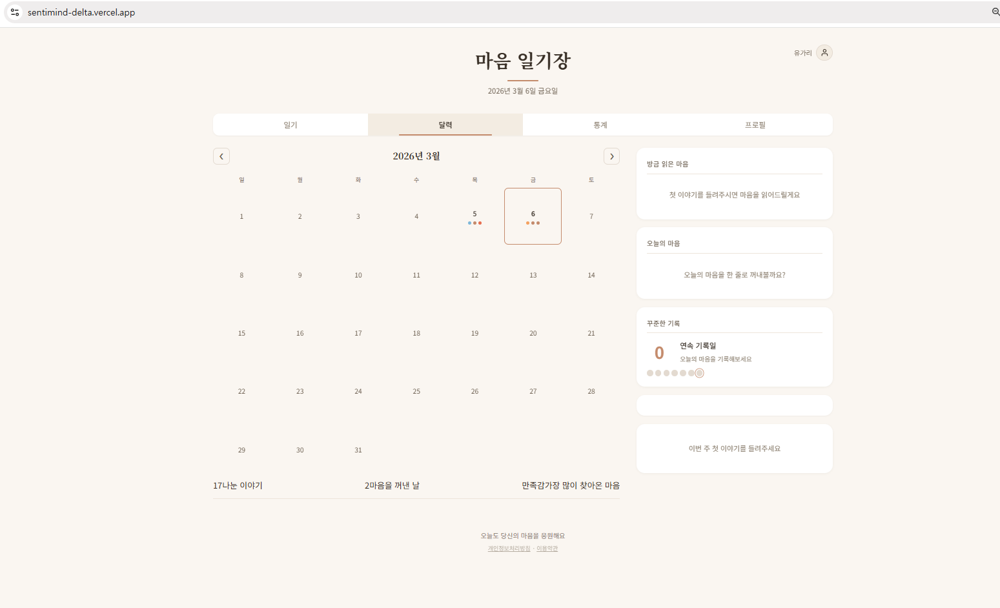
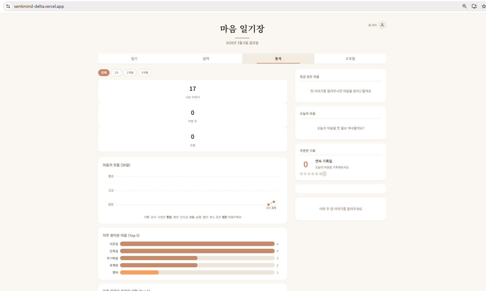
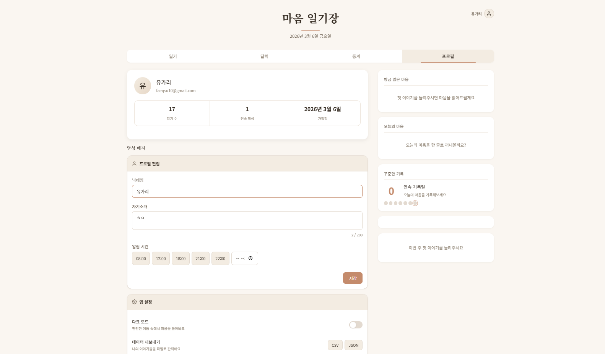

# Sentimind

한 줄 일기를 쓰면 AI가 당신의 감정을 읽어주는 다이어리

[](https://senti-mind.com)
[](https://nodejs.org)
[](LICENSE)

[**지금 체험하기** (회원가입 없이 가능)](https://senti-mind.com)

<p align="center">
  
</p>

## 소개

Sentimind는 하루를 한 줄로 기록하면 Google Gemini AI가 감정을 분석하고, 따뜻한 공감 메시지를 건네는 감정 다이어리입니다. 30가지 세부 감정을 3단계 계층으로 분류하고, 5가지 생활 도메인의 상황을 자동으로 인식합니다. 회원가입 없이도 즉시 체험할 수 있습니다.

## 핵심 기능

| 기능 | 설명 |
|------|------|
| **AI 감정 분석** | Gemini 2.5 Flash 기반 3단계 감정 계층 분류 + 5가지 생활 도메인 상황 인식 |
| **AI 페르소나** | 8종 대화 스타일 (따뜻한 친구, 차분한 코치, 감성 시인 등), 응답 길이/강도 조절 |
| **감정 달력 & 스트릭** | 히트맵 캘린더로 감정 흐름 시각화, 연속 기록 뱃지 시스템 |
| **마음의 별자리** | 감정 온톨로지 기반 SVG 그래프 시각화 (힘 기반 레이아웃, 6종 별자리 패턴) |
| **게스트 모드** | Anonymous Auth로 회원가입 없이 10회 체험, DB 저장, 가입 시 데이터 자동 이어짐 |
| **PWA & 오프라인** | Service Worker 기반 설치 가능 앱, 오프라인 일기 작성 후 자동 동기화 |

그 외: 3컷 그림일기, AI 주간/월간 리포트, 감정 검색/필터, CSV/JSON 내보내기, 다크 모드, 키보드 단축키

## 스크린샷

<table>
  <tr>
    <td></td>
    <td></td>
  </tr>
  <tr>
    <td align="center">일기 작성 & 히스토리</td>
    <td align="center">감정 달력 히트맵</td>
  </tr>
  <tr>
    <td></td>
    <td></td>
  </tr>
  <tr>
    <td align="center">통계 대시보드</td>
    <td align="center">프로필 & AI 개인화</td>
  </tr>
</table>

## 기술 스택

| 영역 | 기술 | 비고 |
|------|------|------|
| Backend | Node.js 20+ / Express 5 | 9개 모듈화된 라우트 파일 |
| Database | Supabase PostgreSQL | RLS로 사용자별 데이터 격리 |
| AI | Google Gemini 2.5 Flash | 감정 분석, 리포트, 그림일기 생성 |
| Auth | Supabase Auth + Anonymous Auth | JWT 인증, 게스트 → 회원 자동 전환 |
| Frontend | Vanilla JS ES Modules | 프레임워크 없이 16개 모듈 구조 |
| Style | CSS Grid/Flexbox | 반응형, 다크 모드, Gowun 폰트 |
| Deploy | Vercel (Serverless) | CI/CD 자동 배포 |

## 아키텍처

```
Browser (16 ES Modules)  ──fetch──▸  Express 5 (9 Routes)  ──API──▸  Google Gemini 2.5 Flash
         │                                  │
    Service Worker                   Supabase PostgreSQL
   (오프라인 큐잉)                    (RLS, 24 migrations)
```

프론트엔드는 프레임워크 없이 ES Module로 구성되어 있으며, `state.js`의 공유 상태 객체와 dependency injection 패턴으로 모듈 간 순환 의존성을 방지합니다. 백엔드는 `server-v2.js` 코어에서 9개 라우트 모듈을 마운트하는 구조입니다.

상세 아키텍처는 [docs/ARCHITECTURE.md](./docs/ARCHITECTURE.md)에서 확인할 수 있습니다.

## 시작하기

```bash
git clone https://github.com/faeqsu10/Sentimind.git
cd Sentimind
npm install
cp .env.example .env   # GOOGLE_API_KEY, SUPABASE_* 설정
npm start              # http://localhost:3000
```

**필수 환경변수**: `GOOGLE_API_KEY` (Gemini API), `SUPABASE_URL`, `SUPABASE_ANON_KEY`, `SUPABASE_SERVICE_ROLE_KEY`

상세 설정은 [guides/SETUP.md](./guides/SETUP.md) 참고.

## 프로젝트 구조

```
server-v2.js            Express 서버 코어 (미들웨어, 설정)
routes/                 API 라우트 모듈 10개 (auth, entries, analyze, stats, report, error-logs ...)
config/                 Gemini API, Supabase, AI 페르소나 프리셋 설정
lib/                    인증 미들웨어, 입력 검증, 에러 수집기, DB 유틸리티
public/js/              프론트엔드 ES 모듈 17개
public/css/             스타일시트 4개 (다크 모드 포함)
migrations/             Supabase 마이그레이션 (001-027)
data/                   감정/상황 온톨로지 JSON
```

## 기술적 결정

이 프로젝트에서 내린 주요 설계 판단과 그 이유입니다.

**Gemini 2.5 Flash `thinkingBudget: 0`** — Thinking 토큰이 출력 토큰 할당량을 소진하는 문제가 있어, 분석 응답에서 thinking을 비활성화합니다. 이로써 안정적인 JSON 응답을 보장합니다.

**Anonymous Auth + RLS** — 게스트 사용자에게도 Supabase Anonymous Auth를 통해 실제 DB 저장과 Row-Level Security를 적용합니다. 회원가입 시 `linkAccount`로 동일 user_id가 유지되어 데이터 마이그레이션이 불필요합니다.

**Vanilla JS ES Modules (프레임워크 없음)** — React/Vue 없이 16개 모듈로 구성하여 DOM 조작, 상태 관리, 모듈 아키텍처를 프레임워크 추상화 없이 직접 구현했습니다. 순환 의존성은 dependency injection 패턴으로 해결합니다.

**3단계 감정 온톨로지** — 30가지 세부 감정을 3단계 계층으로 분류하고, 5개 생활 도메인(대인관계, 직장, 학업, 건강, 자기반성)의 17개 상황 컨텍스트와 매핑합니다. Gemini가 이 구조화된 스키마에 맞춰 분석 결과를 반환합니다.

**safeEmoji / safeEmojiHtml 분리** — DB에 텍스트로 저장된 이모지 값의 XSS를 방지하기 위해, `textContent` 용 `safeEmoji()`와 `innerHTML` 용 `safeEmojiHtml()`을 분리합니다. 출력 인코딩은 호출 지점에서 결정합니다.

## 문서

| 문서 | 내용 |
|------|------|
| [Architecture](./docs/ARCHITECTURE.md) | 시스템 아키텍처 및 데이터 흐름 |
| [API Reference](./docs/API.md) | 모든 API 엔드포인트 참조 및 예시 |
| [Database](./docs/DATABASE.md) | Supabase 스키마, RLS, 마이그레이션 |
| [Deployment](./docs/DEPLOYMENT.md) | 로컬/Vercel 배포 가이드 |

## 라이센스

ISC License - [LICENSE](LICENSE) 참고

---

Built with [Google Gemini](https://ai.google.dev/), [Supabase](https://supabase.com/), [Express](https://expressjs.com/)
